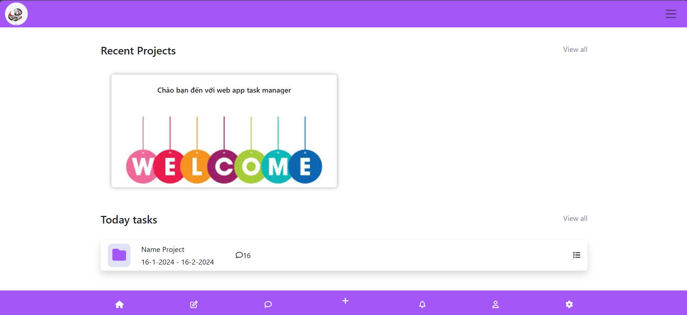
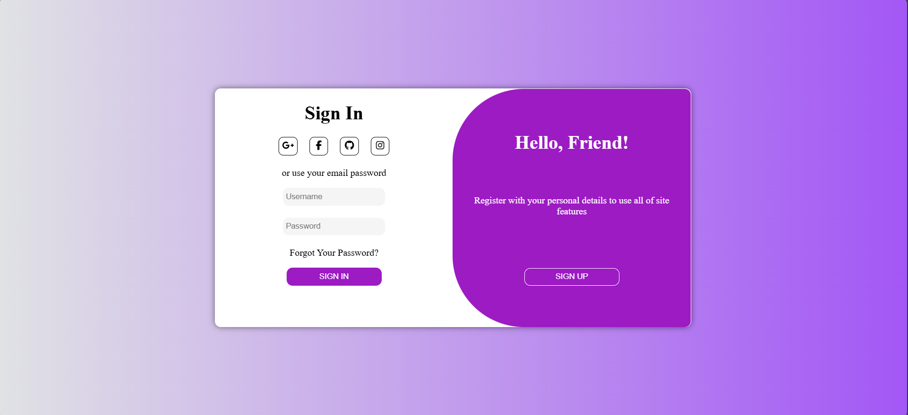
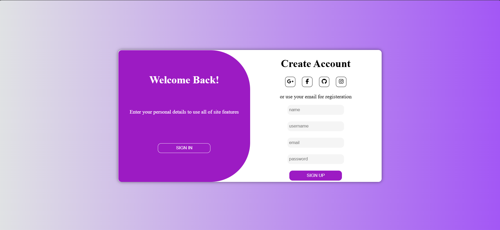

# TODO LIST WEB

A Node.js and Express.js backend application for managing tasks, CRUD operations for tasks, PostgreSQL for data storage, chat real time using WebSocket.


## Technologies Used

- **Frontend**:
  - HTML5, CSS3, JavaScript, Bootstrap V

- **Backend**:
  - Node.js
  - Express.js
  - PostgeSQL for the database
  - Websocket to handle real-time connections

- **Tools**:
  - Git for version control
  - Postman for API testing


## Features

- **Add new tasks:** Easily add new tasks with a title, start date/time, and end date/time.  
- **Edit and delete tasks:** Each task can be edited and deleted, users can be added, and user permissions can be modified easily.  
- **Sorting and searching:** Sort tasks by end date, start date, or task name, and search tasks by name.  
- **Notifications:** The app has internal notifications but does not support external push notifications on the device screen.  
- **Friend requests and basic chat:** The app allows users to send friend requests and chat with others.  
- **Additional features integrated from Firebase Auth:** Password recovery, login, registration, and password updates.  

## Project's Screenshots =>






### Installation

1.  Install the prerequisities softwares, then

2.  Clone the repo, you can use the following the command:

    ```bash
    git clone https://github.com/DangCaoHau2004/task-manager-web.git
    ```

3.  Navigate to project directory

    ```bash
    cd task_manager_web
    ```

4.  Install dependencies

    ```bash
    npm install
    ```

5.  Create your `.env` file take reference from `sample.env`

6.  Start server

    ```bash
    npm start
    ```

    OR

    ```bash
    npm run dev
    ```
